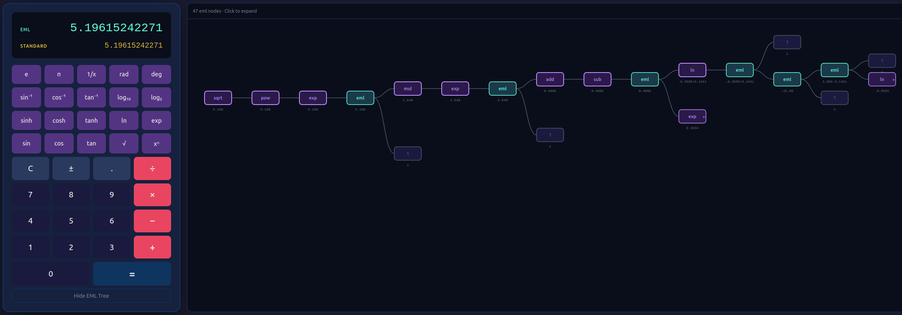
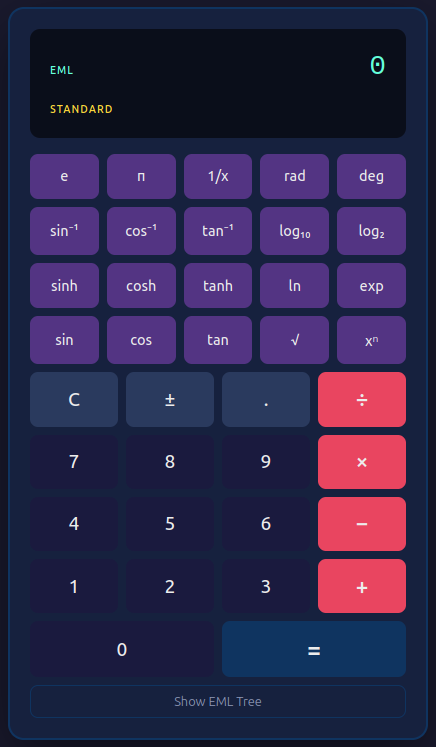

# EML Calculator

A browser-based scientific calculator that computes every operation using a single binary operator:

```
eml(x, y) = exp(x) - ln(y)
```

In 2026, Odrzywolek proved that this operator, paired with the constant `1`, can reconstruct **all** elementary mathematical functions -- the continuous analog of the NAND gate. This calculator demonstrates that result: every computation is performed entirely through nested `eml()` calls, with results displayed alongside standard math library output for comparison.



## Features

- **Dual display** -- EML-computed result (teal) and standard `Math` library result (gold) shown side by side
- **Full scientific calculator** -- trig, inverse trig, hyperbolic, logarithms, powers, roots, angle conversion
- **EML constants** -- `e` and `pi` derived purely from `eml` and `1`
- **Interactive tree visualization** -- expand any operation to see its decomposition into `eml()` calls, with pan, zoom, and switchable left-to-right / top-to-bottom orientation
- **No backend** -- all computation happens in the browser
- **Docker-ready** -- single-command deployment via nginx



## Quick start

```bash
npm install
npm run dev
```

Open http://localhost:5173.

## Docker

```bash
docker build -t eml-calculator .
docker run -p 8080:80 eml-calculator
```

Open http://localhost:8080.

## How it works

The EML engine bootstraps all of mathematics from a single function:

| Level | What's built | How |
|-------|-------------|-----|
| 0 | `eml(x,y)`, constant `1` | Primitive |
| 1 | `e`, `exp` | `e = eml(1,1)` &nbsp; `exp(x) = eml(x,1)` |
| 2 | `ln` | `ln(x) = eml(1, eml(eml(1,x), 1))` |
| 3 | `0`, subtraction | `x - y = eml(ln(x), exp(y))` |
| 4 | negation, addition | `-x = 0 - x` &nbsp; `x + y = x - (-y)` |
| 5 | multiplication, division | `x * y = exp(ln(x) + ln(y))` |
| 6 | constants | `2`, `1/2`, `-1`, `i`, `pi` |
| 7 | powers, roots | `x^y = exp(y * ln(x))` |
| 8 | trig | `sin(x) = (exp(ix) - exp(-ix)) / 2i` |
| 9+ | inverse trig, hyperbolic, logarithms, conversions | Built from the levels above |

Complex arithmetic is used internally (required for trig via Euler's formula). Only real parts are displayed.

## Available functions

| Row | Buttons |
|-----|---------|
| Constants | `e` &nbsp; `pi` &nbsp; `1/x` &nbsp; `rad` &nbsp; `deg` |
| Inverse trig | `sin⁻¹` &nbsp; `cos⁻¹` &nbsp; `tan⁻¹` &nbsp; `log₁₀` &nbsp; `log₂` |
| Hyperbolic | `sinh` &nbsp; `cosh` &nbsp; `tanh` &nbsp; `ln` &nbsp; `exp` |
| Trig | `sin` &nbsp; `cos` &nbsp; `tan` &nbsp; `sqrt` &nbsp; `x^n` |
| Arithmetic | `+` &nbsp; `-` &nbsp; `*` &nbsp; `/` &nbsp; `=` |

Keyboard shortcuts: digits, `+` `-` `*` `/` `^` `.` `Enter` `Escape`

All trigonometric functions use radians. Use `rad` and `deg` to convert.

## Tests

```bash
npm test          # 174 tests
npm run test:watch
```

## Documentation

- [RUNBOOK.md](docs/RUNBOOK.md) -- build, run, and operate the application
- [PROJECT.md](docs/PROJECT.md) -- original project definition and requirements

## Reference

Based on [All elementary functions from a single operator](reference/All%20elementary%20functions.md) by Andrzej Odrzywolek (2026). [arXiv:2603.21852](https://arxiv.org/abs/2603.21852)

## Tech stack

React 19, TypeScript 6, Vite 8, Vitest, Docker/nginx. Zero runtime dependencies beyond React.
